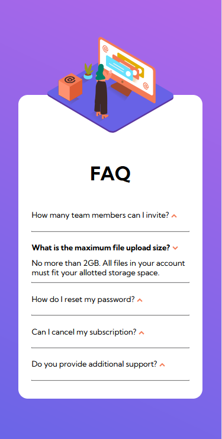

# Frontend Mentor - FAQ accordion card solution

This is a solution to the [FAQ accordion card challenge on Frontend Mentor](https://www.frontendmentor.io/challenges/faq-accordion-card-XlyjD0Oam). Frontend Mentor challenges help you improve your coding skills by building realistic projects. 

## Table of contents

- [Overview](#overview)
  - [The challenge](#the-challenge)
  - [Screenshot](#screenshot)
  - [Links](#links)
  - [Open ToDo's](#open-todo's)
- [My process](#my-process)
  - [Built with](#built-with)
  - [What I learned](#what-i-learned)
  - [Continued development](#continued-development)
  - [Useful resources](#useful-resources)
- [Author](#author)
- [Acknowledgments](#acknowledgments)

<!-- **Note: Delete this note and update the table of contents based on what sections you keep.** -->

## Overview

### The challenge

Users should be able to:

- (View the optimal layout for the component depending on their device's screen size)
- (See hover states for all interactive elements on the page)
- **Hide/Show the answer to a question when the question is clicked**

### Screenshot



https://user-images.githubusercontent.com/49591562/180183920-add543d3-d9bf-469f-91fb-5141900e5bfa.mp4


<!-- Add a screenshot of your solution. The easiest way to do this is to use Firefox to view your project, right-click the page and select "Take a Screenshot". You can choose either a full-height screenshot or a cropped one based on how long the page is. If it's very long, it might be best to crop it.

Alternatively, you can use a tool like [FireShot](https://getfireshot.com/) to take the screenshot. FireShot has a free option, so you don't need to purchase it. 

Then crop/optimize/edit your image however you like, add it to your project, and update the file path in the image above.

**Note: Delete this note and the paragraphs above when you add your screenshot. If you prefer not to add a screenshot, feel free to remove this entire section.** -->

### Links

- Solution URL: [Add solution URL here](https://your-solution-url.com)
- Live Site URL: [Add live site URL here](https://your-live-site-url.com)

### Open ToDo's
- position arrow correctly on right end of #faq-box
- add opening functionality on click on arrow (same as for click on question)
- insert shadow image below graphic (mobile)
- add correct colors to all texts
- add drop shadow for #faq-box
- eventually maybe set font-size of p back to 12px
- make everything work on desktop too

## My process
- focus on JavaScript functionality
- HTML/CSS not so important
  - several tasks omitted

### Built with

- Semantic HTML5 markup
- CSS custom properties
<!-- - Flexbox -->
<!-- - CSS Grid -->
- Mobile-first workflow
<!-- - [React](https://reactjs.org/) - JS library -->
<!-- - [Next.js](https://nextjs.org/) - React framework -->
<!-- - [Styled Components](https://styled-components.com/) - For styles -->
- vanilla JavaScript

<!-- **Note: These are just examples. Delete this note and replace the list above with your own choices** -->

### What I learned

<!-- Use this section to recap over some of your major learnings while working through this project. Writing these out and providing code samples of areas you want to highlight is a great way to reinforce your own knowledge.

To see how you can add code snippets, see below:

```html
<h1>Some HTML code I'm proud of</h1>
```
```css
.proud-of-this-css {
  color: papayawhip;
}
```
```js
const proudOfThisFunc = () => {
  console.log('🎉')
}
```

If you want more help with writing markdown, we'd recommend checking out [The Markdown Guide](https://www.markdownguide.org/) to learn more.

**Note: Delete this note and the content within this section and replace with your own learnings.** -->

#### HTML
- [\<hr>-tag](https://www.w3schools.com/howto/howto_css_dividers.asp) for dividers

#### CSS
- [transform property to rotate images](https://www.w3schools.com/cssref/css3_pr_transform.asp)

#### JavaScript
- thinking in basic logic of connections between HTML, CSS & JavaScript
- navigating to parentElement and selecting childElements, [using `querySelector()` on parent element](https://stackoverflow.com/a/68606927)

##### Revised
- [`toggle()`](https://developer.mozilla.org/en-US/docs/Web/API/DOMTokenList/toggle) to add and remove CSS classes from html classList (on click) and change appearence of respective html element that way
- definition of basic variables using [`querySelectorAll()`](https://developer.mozilla.org/en-US/docs/Web/API/Document/querySelectorAll)
- navigation through DOM using [`querySelector()`](https://developer.mozilla.org/en-US/docs/Web/API/Document/querySelector)
- basic usage of event [`addEventListener()`](https://developer.mozilla.org/en-US/docs/Web/API/EventTarget/addEventListener)
- [iterate through list of document elements (returned by `querySelectorAll()`) - using `.forEach()`](https://github.com/Sammeeey/sortable-drag-drop-js/blob/96ce9e0600823251cda85eddc5ec84e49cb2879d/script.js#L6)
  - to add event listeners to all of the elements & eventually toggle their `classList`s to add or remove certain tokens (aka. CSS classes) - so that they change their appearance on click 

### Continued development

<!-- Use this section to outline areas that you want to continue focusing on in future projects. These could be concepts you're still not completely comfortable with or techniques you found useful that you want to refine and perfect.

**Note: Delete this note and the content within this section and replace with your own plans for continued development.** -->

- basic understanding of vanilla JavaScript
- eventually learn frontend libraries/frameworks (React or Vue.js(?))
- **early validation of project/business ideas** (without code)
- maybe even usage of no-code tools for rapid MVP development
- realization of own project ideas

### Useful resources

<!-- - [Example resource 1](https://www.example.com) - This helped me for XYZ reason. I really liked this pattern and will use it going forward.
- [Example resource 2](https://www.example.com) - This is an amazing article which helped me finally understand XYZ. I'd recommend it to anyone still learning this concept.

**Note: Delete this note and replace the list above with resources that helped you during the challenge. These could come in handy for anyone viewing your solution or for yourself when you look back on this project in the future.** -->

See [What I learned](#what-i-learned)

## Author

- Website - [Samuel Hartmann](https://www.SamuelHartmann.de)
- Frontend Mentor - [@Sammeeey](https://www.frontendmentor.io/profile/Sammeeey)
- Twitter - [@CoderMatching](https://www.twitter.com/CoderMatching)
- Twitch - [Sammeeey](https://www.twitch.tv/sammeeey/)
- GitHub - [Sammeeey](https://github.com/Sammeeey/)
- stackoverflow - [Sammeeey](https://stackoverflow.com/users/12946000/sammeeey)
- LinkedIn - [Samuel Hartmann](https://www.linkedin.com/in/samuel-hartmann-berlin/)

<!-- **Note: Delete this note and add/remove/edit lines above based on what links you'd like to share.** -->

<!-- ## Acknowledgments

This is where you can give a hat tip to anyone who helped you out on this project. Perhaps you worked in a team or got some inspiration from someone else's solution. This is the perfect place to give them some credit.

**Note: Delete this note and edit this section's content as necessary. If you completed this challenge by yourself, feel free to delete this section entirely.** -->
